# ssh-raspberry-pi-beginners-guide
This is a guide for using SSH to connect to a Raspberry Pi on a local network. 

## Requirements:

- Raspberry Pi Imager (free software)

- Raspberry Pi Single-Board Computer

- Micro SD card with at least 32 gigabytes of storage  (and a way to connect it to your personal computer)

## Install Raspberry Pi Imager

**1.** If you have no tdone so already, go to the *[Raspberry Pi website](https://www.raspberrypi.com/software/)* and download the Raspberry Pi imager for your personal computer's operating system (Windows, Mac, Linux).

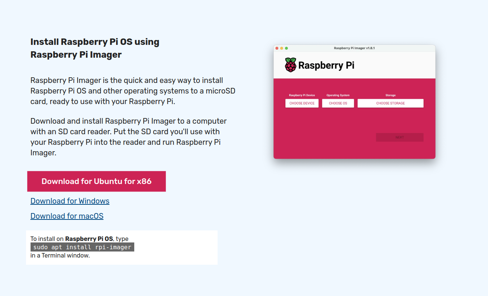

**2.** Once it has been installed, look for the Raspberry Pi Imager application and open it to confirm successful instalation.  The application may just be called "Imager" but it should have the Raspberry Pi logo as its icon (a purple/pink image of a raspberry as of December 2024).

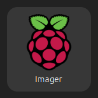

## Install the operating system on your Raspberry Pi

**1.** Insert your MicroSD card into your computer with a USB adapter or full-sized SD card with a slot for Micro SDs.

**2.** Open the Raspberry Pi Imager app. You should see a window that looks like this:

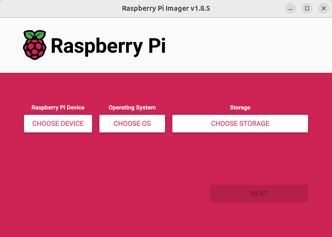

**3.** Click on "CHOOSE DEVICE" and you should see the following screen:

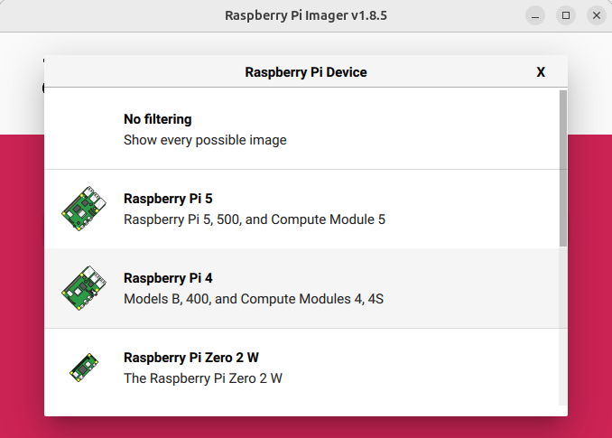

**4.** Selet the specific Raspberry Pi on which you would like to install an operating system.

**5.** Click on "CHOOSE OS" and you should see the following screen:

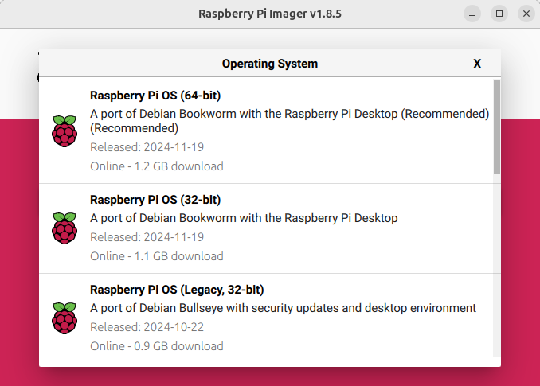

**6.** Select the operating system which you would like to install onto your Raspberry Pi device.  If you would like to use an ISO downloaded onto your personal computer, scroll down to where it says "USE CUSTOM" and select the ISO image of your desired image within your file explorer.

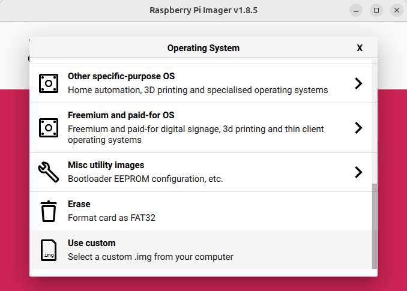

**7.** Click on "CHOOSE STORAGE" and you should see the following screen:

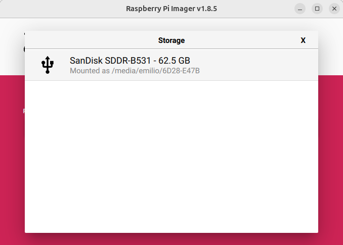

You should see a list of all external storage devices currently conected to your computer (if any are connected).

**8.** Once you have chosen a device, an OS, and a memory device, click on "NEXT" and you should see the following screen:

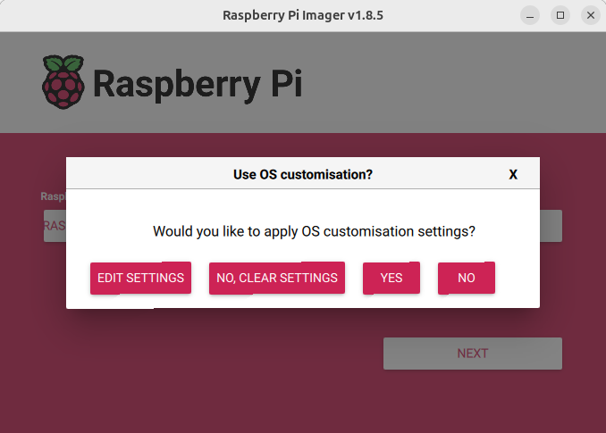

**9.** Click on "Edit Settings and you should see the following screen:

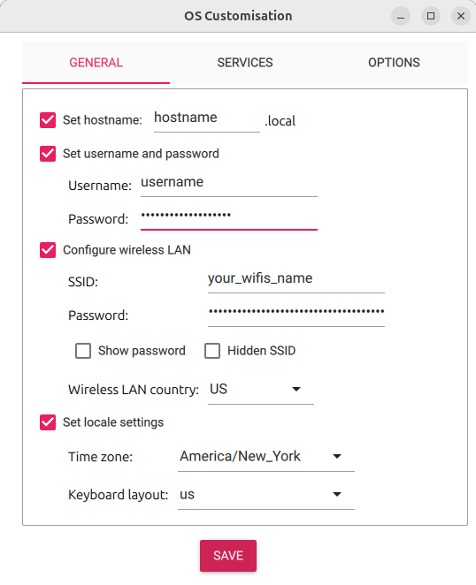

**10.** Set the hostname, username, password, SSID (the name of the WiFi which you choose when you connect to WiFi), your WiFi password, and locale settings.

**Make sure to remember the hostname, username and password as they will be needed in the following steps!**

**11.** Click on the "Services" tab at the top of the OS Customization window and you should see the following screen:

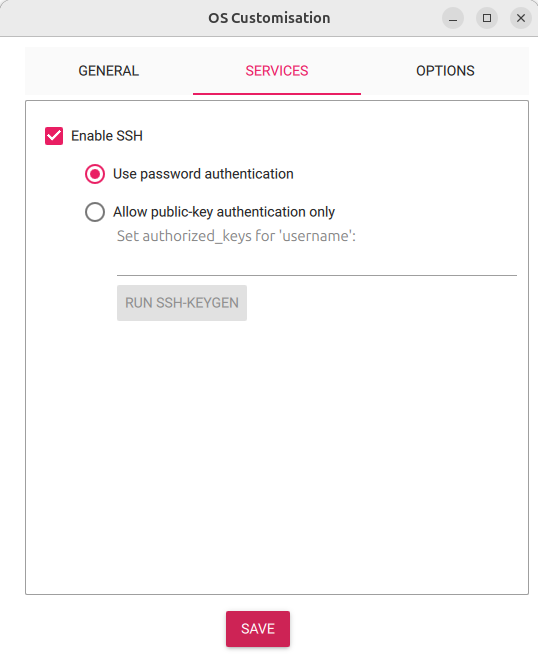

** Make sure that the "ENABLE SSH" and "USE PASSWORD AUTHENTICATION" options are checked.

**12.** The default settings in the "Options" tab can be left as they are.

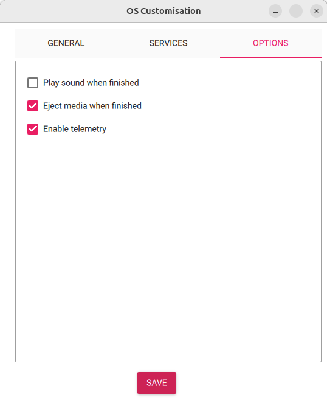

**Make sure that the box marked "EJECT MEDIA WHEN FINISHED" is checked!**

**13.** Click "Save" and you should return to the following screen:

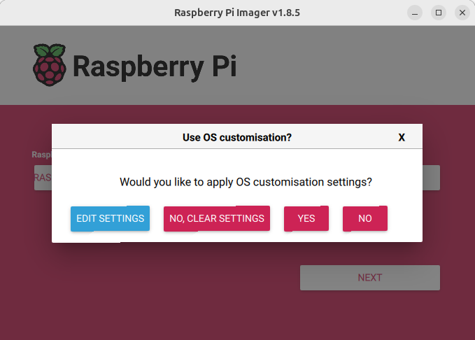

**14.** Click "YES" and you should see the following screen:

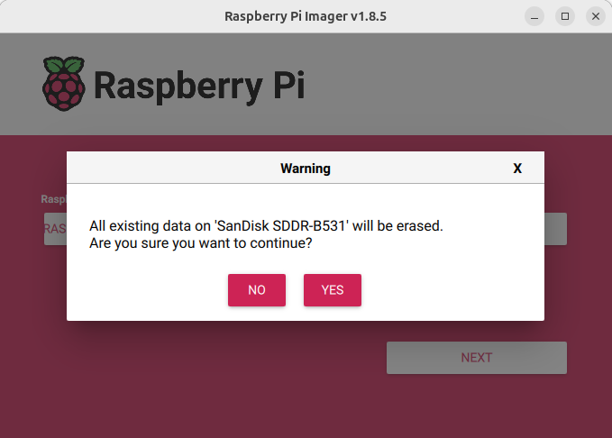

Click "YES" again.

**15.** Wait for the process to complete.  It will take a few minutes for the image to be written to the Micro SD card.  Exact time will depend on your operating system and hardware.

**16.** When the process is complete, Raspberry Pi Imager should let you know that you can safely remove the Micro SD card.

**17.** Put the Micro SD card into the Micro SD card slot of your Raspberry Pi device.

**18.** Plug your power source into your Raspberry Pi (or plug it into the wall using the power adapter) and wait a few minutes for the system to start up.

**The Raspberry Pi device should boot the operating system image from the Micro SD card.**

## Use SSH to remotely access your Raspberry Pi. 

**1.** Enter a terminal or command prompt on your personal computer.

**2.** Enter the folllowing command into your terminal or command prompt with the username and hostname which you chose in the previous steps:

```bash
ssh [username]@[hostname]
```
For example, if your chosen username was **emilio** and your hostname was **myHostName**, then the command would be as follows: 

```bash
ssh emilio@myHostName
```

**3.** You should see a prompt for the user's password (the password which you set in previous steps), but if you get some sort of error and are unable to connect, then review the information below.

# Common Issues:

## 1. Unable to resolve hostname.

When you attempt to SSH into your Raspberry Pi, you may see an error stating that SSH 

**"Could not resolve hostname [your_hostname]: Name or Service Unknown"**  

The following steps should allow you to SSH into your Raspberry Pi device:

**1.** First find the IP address of your Raspberry Pi device by first entering the following script into your terminal:

```bash
ifconfig
```
You will then see a list of network parameters for each interface.  One of these interfaces should read something like "wlan0", "wlp2s0", or something similar (usually it will be the last specification block listed).  Write down the exact name of this interface for use in the previous step.

**2.** Type the following code into your terminal replacing the text [network_name] with the network name which you wrote down in the previous step:

```bash
sudo arp-scan -l --interface=[network_name]
```

For example, if your interface is called "wlp2s0", then the command should be written as follows:

```bash
sudo arp-scan -l --interface=wlp2s0
```

You will then see a list of IP addresses, first written in arabic numerals (normal numbers), then in hexidecimal, then the name of the companty which made the device.  **One of these lines should finish with **Raspberry Pi Trading Ltd**.  Note the IP address written at the left side of the same line as this will be needed in the next step.

**3.** Now enter the following command, replacing the text [username] with the username which you originally entered at the time of writing the operating system to your Micro SD card, and replacing the text [IP address] with the IP address which you wrote down in the previous step:

```bash
ssh [username].[IP address]
```

For example, if your username was "emilio" and your Raspberry Pi's IP address was 192.168.0.1, then the commnd should be entered as follows:

```bash
ssh emilio.192.168.0.1
```

**You should now be able to access your Raspberry Pi device via SSH.**

## 2. WARNING: REMOTE HOST IDENTIFICATION HAS CHANGED!

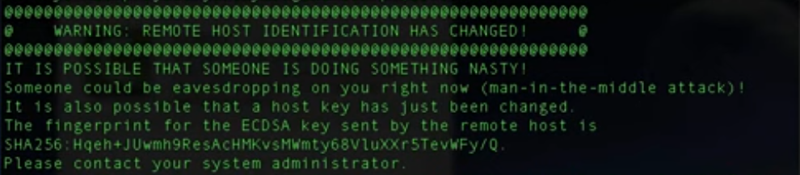

This error is thrown when you SSH into your Raspberry Pi, change the specifications of the device at that IP address (which will take place when you boot another operating system onto your Raspberry Pi), and try to SSH back into your Raspberry Pi device.  Since the username, host name and password have been changed, the system thinks that someone may be manipulating your network maliciously.

**In order to address this issue, we need to reset the configured settings of our device at said IP address by following the following steps:**

**1.** First find the IP address of your Raspberry Pi device by first entering the following script into your terminal:

```bash
ifconfig
```
You will then see a list of network parameters for each interface.  One of these interfaces should read something like "wlan0", "wlp2s0", or something similar (usually it will be the last specification block listed).  Write down the exact name of this interface for use in the previous step.

**2.** Type the following code into your terminal replacing the text [network_name] with the network name which you wrote down in the previous step:

```bash
sudo arp-scan -l --interface=[network_name]
```

For example, if your interface is called "wlp2s0", then the command should be written as follows:

```bash
sudo arp-scan -l --interface=wlp2s0
```

You will then see a list of IP addresses, first written in arabic numerals (normal numbers), then in hexidecimal, then the name of the companty which made the device.  **One of these lines should finish with **Raspberry Pi Trading Ltd**.  Note the IP address written at the left side of the same line as this will be needed in the next step.

**3.** Now enter the following command, replacing the text [username] with the username which you originally entered at the time of writing the operating system to your Micro SD card, and replacing the text [IP address] with the IP address which you wrote down in the previous step:

**4.** Reset the host specifications by entering the following command into your terminal and replacing the text [IP address] with the IP address of your Raspberry Pi device:

```bash
ssh-keygen -R [IP address]
```

For example, if your Raspberry Pi device's IP address is 192.168.0.1, then the command should read as follows: 

```bash
ssh-keygen -R 192.168.0.1
```

**You should now be able to SSH into your Raspberry Pi without any issues.  If you boot another OS onto your Raspbeery Pi or change the remote host identification of your Raspberry Pi device for any other reason, then this step must be repeated.**

## 3. Your personal computer is not set up as an SSH client. 

**The following instructions will allow you to set up a computer with an Ubuntu or Debian-based operating system.**  

Instructions for setting up a computer with a Windows operating system can be found *[HERE](https://learn.microsoft.com/en-us/windows/terminal/tutorials/ssh)* or *[HERE](https://learn.microsoft.com/en-us/windows-server/administration/openssh/openssh_install_firstuse?tabs=gui&pivots=windows-server-2025)*.

**1.** Open the Terminal

**2.** Update the repository by entering the following command: 

```bash
sudo apt update
```

**3.** Install OpenSSH by entering the following command: 

```bash
sudo apt install openssh-server -y
```

**4.** Enable the service by entering the following command: 

```bash
sudo systemctl enable ssh
```

**5.** Start the SSH service by entering the following command: 

```bash
sudo systemctl start ssh
```

**You should now be able to successfully SSH into your Raspberry Pi device.**


