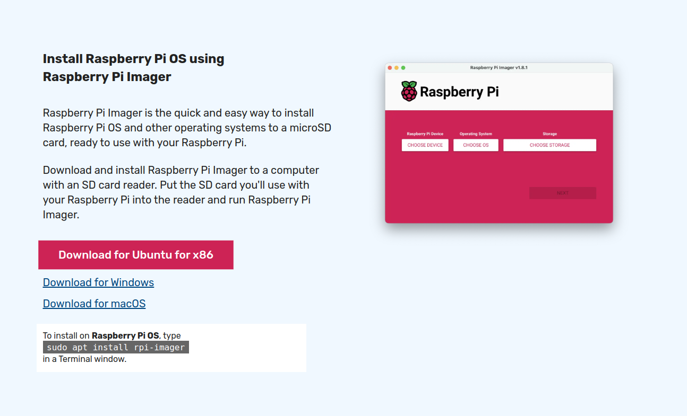
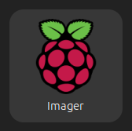
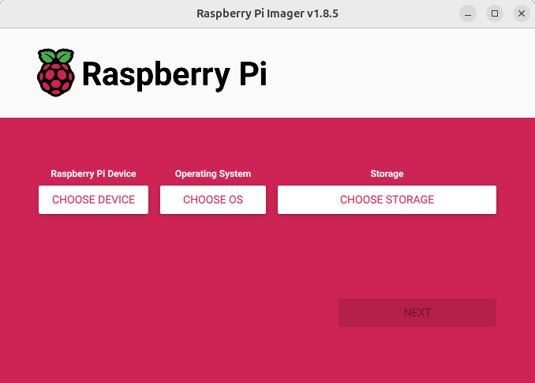
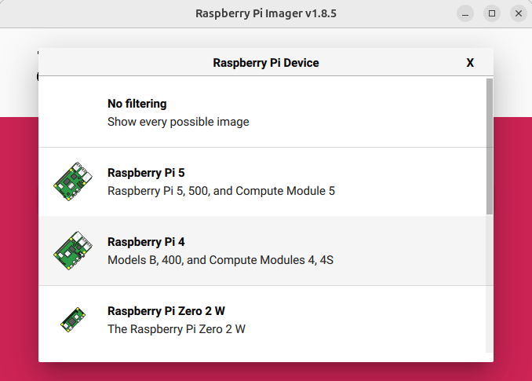

# ssh-raspberry-pi-beginners-guide
This is a guide for using SSH to connect to a Raspberry Pi on a local network. 

## Requirmeents:

- Raspberry Pi Imager (free software)

- Raspberry Pi Single-Board Computer

- Micro SD card with at least 32 gigabytes of storage  (and a way to connect it to your personal computer)

## Get Raspberry Pi Imager

1. If you have nto done so already, go to the *[Raspberry Pi website](https://www.raspberrypi.com/software/)* and download the Raspberry Pi imager for your personal computer's operating system (Windows, Mac, Linux).

2. Once it has been installed, look for the Raspberry Pi Imager application and open it to confirm successful instalation.  The application may just be called "Imager" but it should have the Raspberry Pi logo as its icon (a purple/pink image of a raspberry as of December 2024).

## Install the operating system on your Raspberry Pi

1. Insert your MicroSD card into your computer with a USB adapter or full-sized SD card with a slot for Micro SDs.

2. Open the Raspberry Pi Imager app. You should see a indow that looks like this:

3. Click on "Choose Device" and you should see the following screen:

4. Selet the specific Raspberry Pi on which you would like to install an operating system.

5. 
